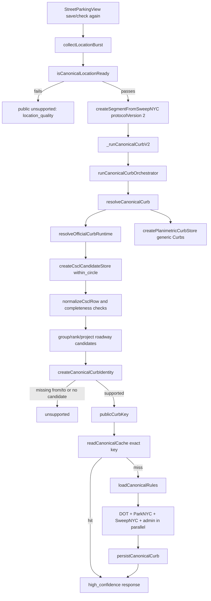
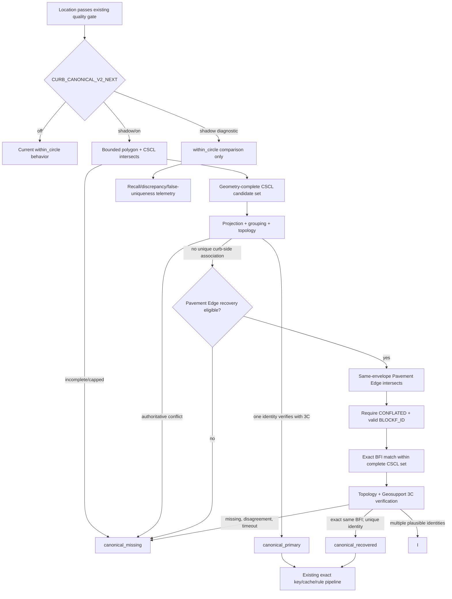
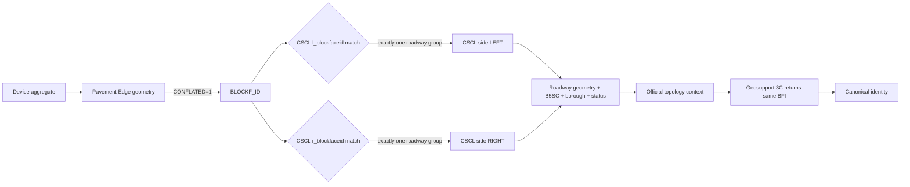
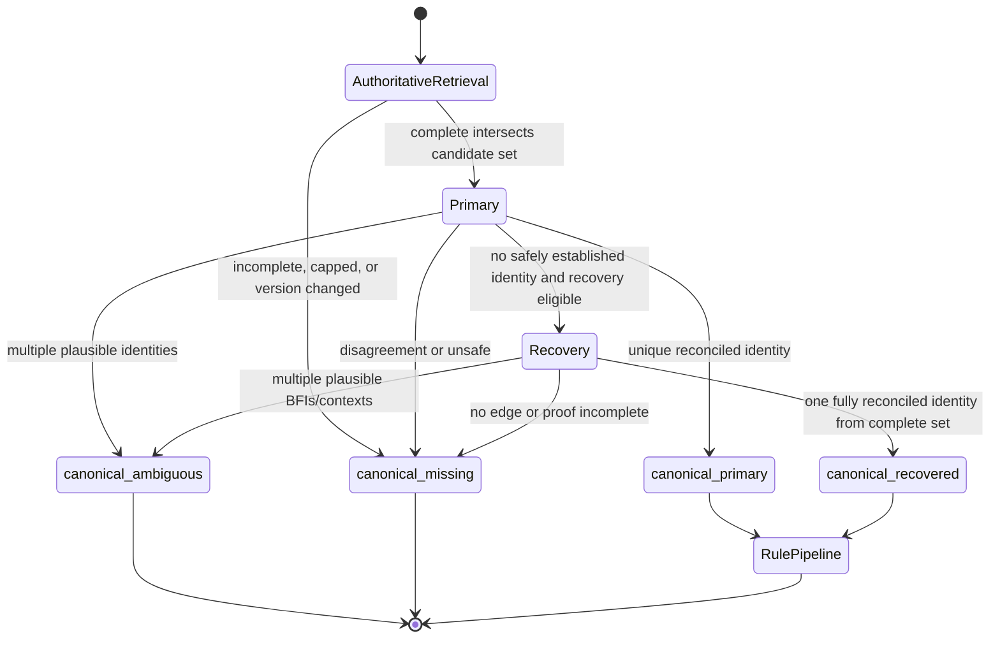

# Canonical Curb Recovery Design

**Status:** Amended for architecture re-review; implementation is not authorized

**Phase:** 2A.35A-R1

**Baseline:** `origin/main` at `504c224db562735ac27fded2713bd6b335d90eb7`

**Scope:** Server-owned canonical curb identity for New York City

## 1. Executive summary

Canonical V2 correctly fails closed, but it currently has two independent launch blockers:

1. its `within_circle` CSCL lookup can omit a long centerline that crosses the search envelope when the line's stored vertices remain outside that envelope; and
2. the live CSCL Socrata view does not publish the `from_street` and `to_street` fields that `createCanonicalCurbIdentity` currently requires.

This design replaces `within_circle` as candidate-set authority. Every next-generation canonical lookup uses an accuracy-aware bounded polygon and CSCL geometry `intersects` as its authoritative primary read. `within_circle` may run only as a diagnostic or shadow comparison and its rows may never define, add to, subtract from, or certify the candidate set. Pavement Edge remains a separate secondary recovery source when a complete CSCL/topology primary path cannot establish identity safely; it is not the mechanism that makes the primary CSCL read complete.

Two invariants govern the design:

> Canonical identity selection may occur only from a candidate set demonstrated to be complete for the validated geometry envelope under the authoritative retrieval contract.

> Pavement Edge may discover a curb candidate; only reconciled official block-face/topology evidence may establish canonical curb identity.

Canonical identity is established only after all of the following agree:

- the device-location quality gate;
- a bounded official geometry overlap;
- a conflated Pavement Edge block-face relationship;
- the corresponding CSCL left/right block-face field and roadway geometry;
- a versioned official topology record that supplies the on/from/to block context; and
- the existing private Geosupport Function 3C resolver returning the same block-face ID for that reconstructed tuple and side.

Any conflict, missing link, perpendicular ambiguity, incomplete source read, or timeout fails closed. Recovered identities use the existing `curb2_...` exact key, cache, rule fan-out, persistence, and client contract. No proximity cache is introduced.

Implementation may begin only after this amended design is approved and a 5,000-point benchmark plan has been implemented and reviewed. Production enablement additionally requires zero known wrong-street, wrong-side, wrong-block-face, or accepted omitted-roadway associations in authoritative fixtures.

## 2. Problem statement

The current field failure is safe but not launch-quality: location quality passes, the CSCL lookup reports complete coverage, the candidate list is empty, and canonical resolution returns `canonical_candidate_missing`. Because no identity exists, the callable performs no cleaning, meter, or restriction fan-out.

Public-data investigation reproduced the retrieval problem. Seven public CSCL segments containing “Melville” were examined; three were absent from a 50 m `within_circle` lookup at their own mathematical midpoint. A same-envelope polygon `intersects` query returned the omitted lines. This is consistent with sparse-vertex behavior on long multiline geometry. It is not a street-name, borough, alias, from/to ordering, or coordinate-order failure. Critically, a non-zero `within_circle` result does not cure the defect: one roadway may have a stored vertex inside the envelope while another plausible crossing roadway is silently omitted, creating false uniqueness near an intersection.

Candidate recovery alone is insufficient. The current live Centerline resource does not contain `from_street` or `to_street`, while `createCanonicalCurbIdentity` rejects an identity without both. The architecture therefore needs both geometry-complete candidate retrieval and an authoritative block-context source.

## 3. Confirmed launch blockers

### 3.1 Sparse-vertex CSCL retrieval

`createCsclCandidateStore` in `functions/curbIntelligence/csclSocrataAdapter.js` issues:

```text
within_circle(the_geom, latitude, longitude, searchRadiusMeters)
```

The query is bounded and version-checked, but public testing shows that it can exclude a line that geometrically crosses the circle. Increasing the radius until a distant stored vertex is captured would be a blind-radius workaround and would expand the set of competing roads near intersections.

Because this omission can occur whether the returned set is empty or non-empty, `within_circle` cannot prove candidate-set completeness. A non-zero result must not be accepted as authoritative input to identity selection.

### 3.2 Generic Curbs is not identity evidence

`createPlanimetricCurbStore` in `functions/curbIntelligence/planimetricCurbAdapter.js` currently reads generic Curbs resource `5xvt-8cbk`. Its public schema contains geometry and feature metadata, but no official street or block-face relationship. The live schema uses `source_id`; the adapter requires `objectid`. This adapter must not be promoted into an identity authority.

### 3.3 Missing block context

`buildCandidate` in `functions/curbIntelligence/canonicalCurbResolver.js` passes `sourceNative.from_street` and `sourceNative.to_street` into `createCanonicalCurbIdentity`. Those fields are not in the live `inkn-q76z` schema. `createCanonicalCurbIdentity` in `functions/curbIntelligence/canonicalCurbIdentity.js` rejects the result as `invalid_street_context`.

### 3.4 Alias graph is incomplete at runtime

`sndNormalizer.js` builds official local-group relationships keyed by B7SC. The current Centerline view supplies B5SC, but not the local group code needed to form B7SC. B5SC represents the street and groups aliases broadly; B7SC narrows names to the portion where a local group is valid. The initial recovery release must not claim local alias authority without that missing relationship.

### 3.5 Insufficient production evidence

Privacy-safe production telemetry currently represents only three attempts: two location-quality failures and one `canonical_candidate_missing`. It cannot establish citywide coverage or correctness.

## 4. Current architecture

### 4.1 Current canonical flow



The client flow is implemented by `utils/locationBurst.ts`, `utils/canonicalCurbClient.ts`, and `views/StreetParkingView.tsx`. `resolveCanonicalCurbWithLocation` will not invoke the callable unless the aggregate satisfies the same canonical-ready boundary represented by `CURB_RESOLUTION_POLICY`: at least three samples, reported accuracy at most 50 m, and consistency at most 12 m.

`createSegmentFromSweepNYC` in `functions/index.js` authenticates and rate-limits the request before routing protocol V2 to `_runCanonicalCurbV2`. `_runCanonicalCurbV2` lazily loads the canonical modules, requires the existing private resolver configuration, and supplies CSCL, generic Curbs, ParkNYC, SweepNYC, Firestore, and telemetry dependencies to `runCanonicalCurbOrchestrator`.

The current CSCL search radius is produced by `searchPolicy` in `curbResolver.js`:

```text
max(50 m, accuracy × 3 + 50 m, model error × 4 + 30 m)
```

It is capped at 500 m. The normal candidate cap is 100. Current transport completeness requires a valid metadata version before and after the ordered data read, no truncation, and successful normalization of every row; it does not prove geometric completeness when the predicate is `within_circle`. The canonical resolver additionally requires a single source version, supported roadway status, plausible geometry, a valid official face, no unresolved level/roadbed conflict, and a candidate set that is complete. In the proposed architecture, only a non-truncated, version-consistent same-envelope `intersects` read can satisfy the retrieval portion of that completeness contract.

The orchestrator has an 8,000 ms overall deadline. Rule sources use the existing 2,500 ms source deadline and execute in parallel. Exact persistence writes the private identity to `curbIdentities/{publicCurbKey}`, the public segment to `streetSegments/{publicCurbKey}`, and public rules below that segment.

### 4.2 Current failure outcomes

- Bad location evidence: `location_quality` publicly.
- Incomplete, truncated, malformed, or changing CSCL evidence: `candidate_incomplete` publicly.
- Complete CSCL read with zero rows: internal `canonical_candidate_missing`, public `candidate_incomplete`.
- More than two material roadway groups: `intersection_complex`.
- Exactly two visually distinct candidates: visual selector.
- Missing from/to context after a valid row: `candidate_incomplete`.
- Source exception or deadline: `source_unavailable`.

## 5. Why the existing primary query misses segments

[Socrata documents `within_circle`](https://dev.socrata.com/docs/functions/within_circle) for multiline data, but the observed result on the current Centerline view is not equivalent to “the continuous line intersects this circle.” A long two-vertex segment can cross the search circle while neither stored endpoint lies inside it. The same record reappears when the radius reaches a stored vertex or when a WKT polygon is supplied to the documented [`intersects` geometry predicate](https://dev.socrata.com/docs/functions/intersects).

Blindly enlarging the current radius would be unsafe because it would:

- include unrelated parallel and perpendicular roads;
- increase candidate-count truncation risk;
- create a distance-based preference pressure near intersections; and
- fail to address the missing block-context contract.

The correct geometric remedy is a bounded polygon-overlap predicate, followed by the same local exact projection and ambiguity checks already used by the resolver. This remedy applies to every canonical read, not only zero-result reads: otherwise a partial non-zero result can conceal a crossing roadway and incorrectly appear unique.

## 6. Why generic Curbs data is insufficient

NYC describes the generic Curbs layer as physical curb geometry. Its published fields do not include roadway name, CSCL side, block-face ID, or a conflation relationship. Geometry proximity alone cannot establish which roadway, side, or block owns the curb.

The current adapter also does not match the live identifier field. Correcting `objectid` to `source_id` would make the geometry readable, but would not turn it into canonical identity evidence. The generic adapter should be retired from canonical resolution rather than repaired as part of recovery.

## 7. Why Pavement Edge is appropriate

[NYC Planimetric Pavement Edge resource `vs44-rznx`](https://data.cityofnewyork.us/Environment/NYC-Planimetric-Database-Pavement-Edge/vs44-rznx) publishes:

- multiline pavement-edge geometry;
- `BLOCKF_ID`;
- `CONFLATED`; and
- source/status metadata.

[NYC's official capture rules](https://github.com/CityOfNewYork/nyc-planimetrics/blob/master/Capture_Rules.md) state that a conflated Pavement Edge block-face ID was linked to the corresponding left or right CSCL block-face relationship. The rules also document exceptions: edges can be non-conflated where CSCL is absent, and median, bridge, divided-road, and complex-intersection cases require special handling. Therefore:

- `CONFLATED=1` and a valid `BLOCKF_ID` are mandatory candidate-generation evidence;
- non-conflated edges can never produce a canonical identity;
- the BFI must be found on exactly one material CSCL side/roadway group; and
- complex or conflicting relationships fail closed.

Pavement Edge is a discovery and physical-side corroboration source. CSCL topology plus Geosupport remains the roadway/block identity authority.

## 8. Primary-path recommendation

The design chooses **Option A: `intersects` as the authoritative canonical primary read**.

1. Construct the same accuracy-aware bounded search polygon for every eligible next-generation canonical lookup.
2. Query CSCL with `intersects` and treat that result as the only authoritative candidate set.
3. Require source-version consistency, successful normalization of every row, and a result below the cap before the set is marked complete.
4. Apply local projection, roadway grouping, ambiguity policy, official topology construction, and Function 3C verification to that complete set. A unique reconciled identity produces `canonical_primary`.
5. Permit `within_circle` only in diagnostic tooling and `shadow` mode. Compare it with the authoritative set for recall, discrepancy, and false-uniqueness telemetry, but never use it for identity selection.
6. Invoke Pavement Edge recovery only after the geometry-complete CSCL/topology primary path lacks a unique curb-side association without an authoritative contradiction. Recovery may add official physical-side/BFI evidence, but it must carry every plausible CSCL roadway into reconciliation and may not override source incompleteness, candidate truncation, invalid topology, or a Function 3C disagreement. If more than one identity remains plausible after the added evidence, the outcome is ambiguous.

Option B would retain two production reads before every acceptance and require rules for reconciling their disagreement even though only `intersects` can serve as authority. Option A removes that redundant correctness surface, avoids one mandatory provider query in `on` mode, and still preserves a safe old-versus-new comparison in `shadow` mode.

The primary search polygon uses the **same radius returned by the existing `searchPolicy`**, including its existing 500 m maximum. It does not enlarge that radius. The polygon is a deterministic 24-vertex geodesic approximation centered on the submitted aggregate. Twenty-four vertices keep radial error below 1% while keeping WKT well below normal URL limits. The implementation must generate longitude/latitude WKT with a closed ring and reject non-finite or out-of-NYC vertices.

Candidate rows returned by `intersects` are projected locally against the actual point. Polygon intersection generates a geometry-complete input set; it does not make every intersecting line plausible. Existing projection, width, roadway status, level, grouping, endpoint, and ambiguity policy remains in force without lowered thresholds. Perpendicular roads remain present until those rules either reject them through authoritative evidence or return ambiguity.

The CSCL cap remains 100 and the normal CSCL source deadline remains 2,500 ms. A 101st row makes the primary read incomplete and therefore missing, never “best of first 100.”

## 9. Primary and recovery architecture



The next-generation primary and recovery units have narrow responsibilities:

- **Search polygon builder:** constructs and validates the same-envelope WKT polygon.
- **Authoritative CSCL reader:** returns the version-consistent, geometry-complete `intersects` candidate set for both primary resolution and recovery reconciliation.
- **Diagnostic CSCL reader:** optionally runs `within_circle` in shadow/research contexts and cannot supply identity candidates.
- **Pavement Edge reader:** normalizes `source_id`, geometry, `blockf_id`, `conflated`, and a stable source version.
- **Block-face reconciler:** joins edge BFI to CSCL left/right fields and rejects conflicts.
- **Topology index:** returns official, versioned on/from/to candidates for one BFI without a radial lookup.
- **Geosupport verifier:** validates a bounded set of topology-derived tuples through the existing private resolver.
- **Canonical resolver:** applies existing location, geometry, ambiguity, identity, and public-contract rules.

## 10. Block-face reconciliation



The reconciler performs these steps:

1. Discard every Pavement Edge row unless `conflated` parses exactly as `1`, `blockf_id` normalizes to a non-zero ten-digit BFI, geometry is valid, source version is present, and the complete result is below the 40-candidate cap.
2. Project the location onto each edge. A candidate is locally compatible only under the existing planimetric distance policy: `distance <= max(12 m, accuracy + modelError + 3 m)`. This reuses the current conservative corroboration boundary; it does not lower a confidence threshold.
3. Join each remaining BFI to the complete authoritative CSCL rows where that same value appears in `l_blockfaceid` or `r_blockfaceid`. If it appears on both sides of one record, on different sides within the same material group, or across distinct material roadway groups, reject it as conflicting.
4. Derive `LEFT` only from an exact left-field match and `RIGHT` only from an exact right-field match. Pavement Edge digitization direction never determines CSCL side.
5. Compare edge and CSCL local tangents as undirected vectors. Reversing either geometry therefore does not change compatibility. Reuse the existing absolute cosine threshold of `0.9`. Missing or unstable local tangents cannot positively corroborate a candidate.
6. Require current constructed/supported CSCL roadway status, one CSCL source version, compatible level codes, valid street width, valid borough, roadway name, and geometry.
7. Group connected CSCL records only under the existing exact face, roadway-type/level, official relationship, and endpoint-connectivity rules. Every supporting record must place the BFI on the same side.

Multiple physical records may support one curb identity when they form one connected official roadway group. Multiple material BFIs or multiple material roadway groups remain ambiguous. No distance tiebreaker may collapse them.

## 11. Block topology and from/to derivation

Runtime reverse geocoding is not an authoritative source for block endpoints. The design introduces a versioned, offline-built topology artifact derived from official CSCL Pub data.

### 11.1 Artifact inputs

The builder consumes a pinned official CSCL Pub release, including at minimum:

- Centerline geometry and GlobalID/PhysicalID;
- left and right block-face IDs;
- borough, B5SC, roadway type/status, and level codes;
- Node geometry when available;
- Centerline-to-name relationships and StreetName records when available; and
- source release metadata plus a SHA-256 digest of every downloaded artifact.

[CSCL Pub](https://github.com/CityOfNewYork/nyc-geo-metadata/blob/main/Metadata/CSCL_Pub.md) documents Node as the official topological junction feature, while the [full CSCL model](https://github.com/CityOfNewYork/nyc-geo-metadata/blob/main/Metadata/CSCL.md) documents `STREETSHAVEINTERSECTIONS`, `NodesHaveSegments`, `CenterlinesToStreetsHaveIntersections`, `SEGMENT_LGC`, and street-name relationships. The builder must prefer explicit relationship tables. Geometry endpoint reconstruction is permitted only as a checked fallback when the published extract omits a relationship table.

### 11.2 Artifact records

The generated artifact is private, immutable, deterministic, and sharded for lazy server loading. It is not browser data. Each BFI entry contains:

```text
topology schema version
source dataset/release/digests
BFI
borough
CSCL side
on-street B5SC and official display name
supporting segment IDs/PhysicalIDs
from-node identity and official intersecting street candidates
to-node identity and official intersecting street candidates
level/roadbed evidence
topology completeness state
```

The artifact builder rejects a BFI from its correctness-eligible set when it cannot identify exactly two block endpoints, when an endpoint relationship is incomplete, when supporting rows disagree on side/level/roadbed, or when more than one non-equivalent on/from/to context remains.

### 11.3 Runtime lookup

Runtime lookup is exact by recovered BFI, never radial. The artifact is loaded lazily inside the callable so function discovery does not parse a citywide topology object. Shards are bounded and cached in-process after first use. A missing shard, digest/version failure, unknown BFI, or incomplete topology record fails closed.

The topology record proposes one bounded Function 3C tuple:

```text
borough
onStreet
crossStreetOne
crossStreetTwo
compassDirection
```

If official relationships yield multiple non-equivalent tuples, v1 does not select among them. It returns `canonical_ambiguous`. Full multi-context alias support is deferred.

### 11.4 Side and reversed geometry

The BFI's left/right CSCL field is authoritative for logical side. The cardinal label is derived from the local tangent of the selected CSCL record and that side, exactly as the current resolver does. Reversing GeoJSON coordinate order reverses the tangent and swaps geometric left/right, but the row's official left/right BFI fields travel with its published digitization direction. Tests must reverse both ordinary and grouped records and prove the same public cardinal curb is recovered only when the official side relationship remains consistent.

## 12. Geosupport verification

The existing `createPrivateBlockfaceResolver` is a strict server-only Function 3C client. Its role remains verification, not candidate discovery.

For each topology-complete primary or recovery candidate, the next-generation resolver sends exactly the five currently accepted fields: borough, on street, the two cross streets, and compass direction. It trusts a result only when the current parser accepts the response, return code is `00`, the BFI is a valid non-zero ten-digit string, all normalized names are present, and source-version fields are valid.

The result must equal the Pavement Edge/CSCL BFI. A different BFI is `geosupport_bfi_conflict`; a reviewed “not authoritative” response is `geosupport_rejected`; transport, authentication, saturation, timeout, invalid response, or unreviewed return code is `geosupport_unavailable`. None can be converted into success.

The existing resolver service URL validation, ID-token authentication, service account, IAM boundary, scale, and memoization remain unchanged. No BFI, tuple, raw Geosupport response, token, or coordinate is returned to the browser or emitted to telemetry.

## 13. Intersection safeguards

Recovery must preserve the White Plains/Maran invariant: a marginally closer perpendicular street cannot win.

An input is classified as intersection-sensitive when any of these is true:

- more than one distinct conflated BFI edge overlaps the recovery envelope;
- more than one material CSCL roadway group overlaps it;
- the selected projection lies within the existing uncertainty interval of a CSCL component endpoint;
- two local edge/centerline tangent families differ materially; or
- the topology artifact marks either endpoint as complex or multi-level.

For an intersection-sensitive input:

- distance ranking can remove a candidate only when its uncertainty interval does not overlap the best interval;
- a tangent match can corroborate an exact edge/roadway pairing but cannot choose between two otherwise complete BFIs;
- heading is ignored in v1 because the request contract contains no independently quality-scored heading sample;
- every surviving BFI must independently pass CSCL, topology, and Geosupport reconciliation; and
- two surviving canonical identities produce `canonical_ambiguous`, even when one is a few metres closer.

The existing visual selector may be used only when there are exactly two fully authoritative, visually distinct candidates with valid server tokens. Recovery must not expose a partially reconciled candidate to the selector.

## 14. Roadway width and geometry plausibility

The current policy checks whether the user-to-centerline distance is no greater than half the CSCL `streetwidth` plus device/model uncertainty. That gate remains unchanged.

The Pavement Edge-to-centerline offset could theoretically be compared with half of `streetwidth`. NYC metadata, however, says positional accuracy varies, and capture rules document medians, multiple roadbeds, bridges, and cases where multiple pavement edges map to one CSCL segment. No source-backed universal numeric tolerance is available.

Therefore v1 recovery will **not** use closeness to `streetwidth / 2` as a positive score or as a way to choose among BFIs. It will record an offline benchmark diagnostic and use only these hard geometry requirements:

- the actual point passes the existing centerline plausibility gate;
- the actual point is compatible with the physical edge under the existing planimetric distance boundary;
- edge and centerline tangents agree under the existing `0.9` threshold; and
- edge BFI side and CSCL BFI side agree exactly.

Any future hard width-offset threshold requires measured error distributions by roadway class and a separate reviewed design.

## 15. Names and aliases

Names are not identity authority in v1.

- CSCL `full_street_name`, `street_name`, and `stname_label` may label or rank candidates after geometry discovery.
- Reverse-geocoded, saved-address, and legacy SweepNYC names may reduce research output or rank already-authoritative candidates, but cannot create or promote one.
- Geometry/BFI conflict always defeats a name match.
- The topology artifact's official relationship name is used to form the Function 3C verification tuple.

[NYC Geosupport documentation](https://nycplanning.github.io/Geosupport-UPG/chapters/chapterIV/section03/) states that B5SC identifies a street and that B7SC adds the local group code for names valid on a particular portion. The current runtime row lacks that local group code, while the current SND index is keyed by B7SC. A broad B5SC alias set could include a name not valid on the target portion. Full local alias resolution is therefore explicitly deferred until an official segment-to-LGC/B7SC relationship is present in the pinned topology source and covered by fixtures.

## 16. Legacy-hint policy

Legacy SweepNYC evidence can ask, “does an official candidate compatible with this hint exist?” It cannot answer that question itself.

Legacy hints may influence the ordering of already-generated recovery candidates. They may not:

- create a BFI;
- bypass `CONFLATED=1`;
- override geometry or topology conflict;
- select between two complete canonical identities;
- reuse legacy rules without canonical confirmation; or
- read or write the old 80 m radial identity cache for a new V2 save.

Legacy-versus-canonical comparison is observational only. Legacy output is never benchmark truth.

## 17. Canonical outcome model

| Outcome | Exact transition condition |
|---|---|
| `canonical_primary` | The authoritative CSCL `intersects` read is complete; exactly one candidate passes geometry/policy plus topology and Function 3C reconciliation. |
| `canonical_recovered` | The authoritative CSCL `intersects` read is complete but lacks a unique curb-side association without an authoritative contradiction; recovery is enabled; exactly one candidate passes Pavement Edge, the complete CSCL set, topology, and Function 3C reconciliation. Every initially plausible roadway participates, and all but one are rejected by authoritative evidence rather than absence from a partial query. |
| `canonical_ambiguous` | Two fully reconciled identities survive, or multiple non-equivalent topology contexts/BFIs remain materially plausible. |
| `canonical_missing` | The authoritative candidate set is not provably complete, no candidate survives, required official evidence is incomplete/unavailable, a source conflicts, candidate limits are exceeded, or a deadline prevents proof. |

Suggested internal reason codes are low-cardinality and contain no identifiers:

```text
authoritative_cscl_complete_zero
authoritative_candidate_set_incomplete
shadow_candidate_set_discrepancy
shadow_false_uniqueness
recovery_source_incomplete
pavement_edge_missing
pavement_edge_nonconflated
pavement_edge_bfi_invalid
multiple_material_bfis
perpendicular_conflict
cscl_bfi_missing
cscl_bfi_side_conflict
topology_missing
topology_ambiguous
geosupport_bfi_conflict
geosupport_rejected
geosupport_unavailable
recovery_candidate_limit
recovery_deadline
```

The public response contract remains `high_confidence`, `ambiguous`, or `unsupported` with the existing public reasons. Internal outcome names and reasons remain server-only.

## 18. Cache design

Primary and recovered next-generation identities use the current exact cache. `publicCurbKey` remains:

```text
curb2_SHA256(jurisdiction, officialBlockFaceId, CSCL resource ID, CSCL source version)
```

The BFI is hashed server-side and is never embedded in a public document ID. A recovered identity retains schema version 2 and uses `resolution.method = authoritative_recovery`; primary and visual-selection methods remain distinguishable internally. Private evidence versions for Pavement Edge, topology artifact, and Geosupport are stored only under `curbIdentities/{key}`.

The orchestrator resolves the current identity before cache lookup, so a changed CSCL version produces a different exact key and cannot accidentally reuse an older identity. No TTL-free proximity match, geohash, radius query, or legacy 80 m fallback is added. Existing V2 identities require no migration. Legacy rules can be copied only through the existing exact compatibility checks after canonical confirmation.

## 19. Common rule-pipeline integration

`canonical_primary` and `canonical_recovered` both return the same canonical identity type to `runCanonicalCurbOrchestrator`. From that boundary onward they are deliberately indistinguishable:

1. generate `publicCurbKey` and the public curb;
2. read the exact canonical cache;
3. on a miss, call `loadCanonicalRules`;
4. run `runCanonicalDotLookup`, `runCanonicalMeterLookup`, `runCanonicalSweepLookup`, and admin lookup in parallel;
5. apply `selectRuleSet` and its DOT-over-SweepNYC conflict hierarchy;
6. persist private identity, public segment, and public rules through `persistCanonicalCurb`; and
7. return the existing high-confidence client response used by Street Intelligence and SAFE UNTIL.

There is no recovery-specific rule confidence, cache, persistence collection, or UI presentation.

## 20. Failure policy



The following always fail closed:

- no demonstrably complete same-envelope CSCL `intersects` candidate set;
- any accepted identity whose validated envelope contains an omitted plausible authoritative roadway;
- no complete Pavement Edge candidate set;
- no conflated edge;
- invalid, zero, or missing `BLOCKF_ID`;
- more than one material BFI without a uniquely provable identity;
- perpendicular-road uncertainty overlap;
- missing or conflicting CSCL left/right BFI;
- unsupported roadway status or unresolved level/roadbed grouping;
- invalid geometry, side, borough, or source version;
- missing/incomplete topology artifact entry;
- missing block endpoints or multiple non-equivalent official tuples;
- Function 3C rejection, timeout, invalid response, or different BFI;
- candidate truncation at either source;
- source mutation during a read; or
- insufficient remaining overall deadline.

Missing evidence produces `canonical_missing`; multiple complete but unresolved identities produce `canonical_ambiguous`. Neither may be converted to success through a distance or name score.

## 21. Performance and query budget

Existing production limits remain unchanged:

- overall orchestrator deadline: 8,000 ms;
- normal source deadline: 2,500 ms;
- planimetric/Pavement Edge deadline: 900 ms;
- CSCL candidate cap: 100;
- Pavement Edge cap: 40; and
- automatic retries: zero.

The offline topology artifact avoids serial endpoint and street-name API calls. Runtime canonical-resolution query bounds are:

| Path | Public data queries | Private resolver calls |
|---|---:|---:|
| Gate failure | 0 logical queries | 0 |
| `off` current behavior | 1 CSCL `within_circle` query | current behavior |
| `on` primary success | 1 authoritative CSCL `intersects` query | exactly 1 Function 3C verification |
| `on` recovery attempt | authoritative CSCL query plus 1 Pavement Edge `intersects` query | at most 1 Function 3C verification for the unique topology-complete candidate |
| `shadow` comparison | CSCL `within_circle` and `intersects` data reads, run in parallel and sharing the version window | next-generation verification may run for measurement but cannot affect output |
| Ambiguous primary/recovery | same applicable public bound | 0 when topology is non-unique; fail before calling 3C |

Metadata reads used for version consistency count as provider requests but not candidate queries. Option A replaces the current primary data query rather than adding a second mandatory query: an `on` primary success is one CSCL data read, two CSCL metadata reads, and one Function 3C request, for four provider HTTP requests before rule fan-out. The maximum `on` recovery path is two data reads (CSCL and Pavement Edge), four metadata reads, and one Function 3C request: seven provider HTTP requests. The maximum `shadow` comparison adds one diagnostic `within_circle` data read inside the same CSCL before/after version window: eight requests. A version change invalidates all reads in that window.

The authoritative `intersects` read remains inside the existing 2,500 ms CSCL deadline. In `shadow`, `within_circle` and `intersects` run in parallel so the diagnostic read does not form a serial dependency; the benchmark must report each query's P50/P95 and the paired wall-clock delta. In `on`, Pavement Edge begins only after primary resolution establishes recovery eligibility, so it adds one bounded serial stage rather than prefetching unnecessary data. Recovery starts only when sufficient overall time remains for the 900 ms Pavement Edge stage, one 2,500 ms Function 3C stage, and normal rule fan-out. Otherwise it returns `recovery_deadline`. Rule sources remain parallel. No client or server retry is added.

The controlled benchmark records logical queries, provider requests, separate `within_circle`/`intersects` P50/P95, parallel shadow wall time, cold/warm topology-shard load time, source latency, resolver latency, total resolution latency, and total callable latency. No latency estimate is treated as established before measurement. Production enablement is blocked if authoritative retrieval or recovery causes the existing 8,000 ms timeout to become a common result.

## 22. Privacy-safe telemetry

Add these server-only structured events:

```text
canonical_candidate_set_compared
canonical_recovery_attempted
canonical_recovery_supported
canonical_recovery_ambiguous
canonical_recovery_missing
```

Allowed fields are fixed allowlists:

- protocol version;
- accuracy bucket;
- primary/recovery candidate-count buckets (`0`, `1`, `2`, `3_plus`);
- candidate-set relation (`equal`, `within_subset`, `within_extra`, `different`, `comparison_incomplete`);
- boolean false-uniqueness flag;
- evidence-count bucket;
- intersection category (`midblock`, `endpoint`, `multi_edge`, `complex`);
- boolean hint flags (`reverse_name`, `legacy_name`, `heading`), even though v1 uses none for authority;
- final resolution class;
- reason enum;
- cache-hit boolean; and
- latency bucket.

The telemetry builder must discard unknown fields. Tests must recursively prove that coordinates, street/address text, UID, BFI/`BLOCKF_ID`, CSCL/edge IDs, raw geometry, raw rows/errors, tokens, exact source tuples, and exact distances never survive. Logging must remain fail-soft.

## 23. 5,000-point benchmark design

The benchmark is deterministic, offline-first, and creates no parking save or production write.

### 23.1 Snapshot acquisition

1. Download pinned official CSCL Pub, Centerline Socrata metadata/export, Pavement Edge, and required street-name/topology resources.
2. Record resource IDs, update timestamps/releases, download URLs, byte sizes, and SHA-256 digests in a machine-readable manifest.
3. Normalize snapshots through the same pure adapters intended for runtime evidence.
4. Reject the run if any schema, digest, row count, required field, or source version is missing.

### 23.2 Truth-eligible population

Build the population from conflated Pavement Edge rows whose BFI maps exactly to one supported CSCL roadway side and one complete topology context. This prevents legacy output or the implementation under test from defining truth.

Select exactly 1,000 base points per borough with a stable seeded hash over source identity and BFI. Within each borough, use overlapping stratification tags and minimum quotas:

- 400 mid-block and 200 endpoint/intersection points;
- 100 narrow residential (`streetwidth <= 30 ft`);
- 100 wide (`streetwidth >= 60 ft`);
- 100 divided/dual-carriageway or median-associated;
- 100 long sparse-vertex segments whose midpoint is more than the primary radius from every stored vertex;
- 100 curved/irregular segments with at least three non-collinear vertices;
- at least 100 numbered and 100 named streets; and
- Queens includes at least 100 hyphenated/numbered-name examples when the official snapshot contains enough truth-eligible records.

Tags may overlap; the selection algorithm fills rare quotas first, then fills mid-block/intersection and borough totals. If an official snapshot cannot meet a quota, the benchmark is invalid rather than silently changing the target.

### 23.3 Point construction and jitter

- Mid-block points are sampled at 25%, 50%, or 75% along a truth edge using a stable hash.
- Endpoint points are sampled inside the final 10% of the edge, not exactly on the mathematical node.
- Each base point is offset to a plausible in-car location on the truth side while remaining inside the official roadway/edge corridor.
- The base input plus deterministic along-edge and cross-edge perturbations of ±3 m, ±5 m, and ±10 m are evaluated where the perturbed truth remains the same official curb.
- Perturbations that cross the official centerline, leave the truth corridor, or enter a different authoritative block face are excluded from stability scoring and retained as explicit boundary tests.
- Accuracy and consistency buckets are assigned before execution and must satisfy or intentionally violate the unchanged location policy.

The 5,000 figure counts base locations. Jitter variants are additional executions and are reported separately.

### 23.4 Candidate-set completeness corpus

For every base point and jitter variant, derive the expected official roadway set independently from the resolver by intersecting the frozen, full-fidelity CSCL snapshot with the exact validated search polygon. Preserve every intersecting supported material roadway group before point-distance ranking. Record whether each expected roadway is physically plausible under the unchanged projection, level, roadbed, and supported-status rules.

Run both retrieval predicates against the same frozen source version and envelope. `intersects` is the proposed authoritative contract; `within_circle` is a diagnostic baseline. Compare normalized source identities and material roadway groups, not row ordering. The corpus must include non-zero cases, intersections, perpendicular crossings, and cases where one roadway has a stored vertex inside the envelope while another crossing roadway has none. An unexplained difference between the authoritative `intersects` result and the offline geometry set makes the fixture/run incomplete; it cannot be scored as a successful identity.

## 24. Ground-truth methodology

A fixture is correctness-eligible only when all ground-truth links are present independently of the resolver under test:

1. Offline full-fidelity CSCL geometry establishes the complete set of official roadways intersecting the validated envelope.
2. Pavement Edge says `CONFLATED=1` and supplies a valid BFI.
3. Exactly one CSCL material roadway group contains that BFI on exactly one consistent left/right side.
4. The point projects compatibly to that physical edge and official roadway.
5. Official topology provides a complete on/from/to block context.
6. The pinned topology verification corpus records a Function 3C success returning the same BFI and normalized tuple.

Expected street is the topology/Geosupport normalized on-street identity; expected side is the exact CSCL left/right BFI relationship plus its published digitization direction; expected block face is the conflated BFI shared by Pavement Edge, CSCL, and Function 3C.

Rows without all five links are excluded from correctness denominators. They remain in a separate coverage-only population labeled by the missing truth component. Exclusion counts and reasons are reported by borough and geometry class so high exclusion cannot conceal weak data coverage.

## 25. Predeclared metrics

Report both base-point and jitter-variant denominators.

### Primary V2

- `canonical_primary` percentage;
- missing percentage;
- ambiguous percentage; and
- source-incomplete percentage, reported separately from authoritative missing.

### Primary plus recovery

- `canonical_primary` percentage;
- `canonical_recovered` percentage;
- remaining missing percentage;
- ambiguous percentage; and
- recovery-attempt and recovery-support rates.

### Required breakdowns

- borough;
- mid-block versus endpoint/intersection;
- narrow, wide, divided, curved/irregular, and sparse-vertex classes;
- numbered, named, and Queens-style naming classes;
- accuracy/consistency bucket; and
- base, ±3 m, ±5 m, and ±10 m jitter.

### Correctness and stability

- wrong street;
- wrong side;
- wrong BFI;
- perpendicular-street selection;
- identity change under truth-preserving jitter;
- supported-to-missing and supported-to-ambiguous jitter transitions;
- candidate truncation;
- topology/Geosupport disagreement; and
- legacy/primary/recovery coverage delta, with legacy explicitly labeled non-truth.

### Candidate-set completeness

- count of expected official roadway groups intersecting each validated envelope;
- `within_circle` candidate and material-roadway recall against the offline geometry set;
- `intersects` candidate and material-roadway recall against the offline geometry set;
- missing, extra, and version-mismatched candidate-set discrepancies for each predicate;
- false uniqueness: `within_circle` returns one material roadway while the authoritative geometry set contains more than one plausible roadway;
- sparse-vertex miss rate for each predicate;
- intersection/perpendicular roadway omission rate for each predicate; and
- percentage of all non-zero `within_circle` queries whose normalized candidate set differs from `intersects`, reported overall and by borough/geometry/jitter class.

### Performance

- logical queries and provider HTTP requests per execution;
- source and Function 3C latency percentiles;
- cold/warm topology shard latency;
- end-to-end resolution percentiles; and
- deadline/timeout rate.

## 26. Hard safety gates

All gates are predeclared and must pass on the frozen benchmark before `on` mode or owner field retest:

1. **Zero** wrong-street associations in correctness-eligible fixtures.
2. **Zero** wrong-side associations.
3. **Zero** wrong-BFI associations.
4. **Zero** perpendicular-road automatic selections where more than one identity remains materially plausible.
5. **Zero** accepted canonical identities where a plausible authoritative roadway intersecting the validated envelope was omitted from the candidate set.
6. **Zero** unexplained omissions from the authoritative `intersects` result relative to the frozen full-geometry ground-truth set.
7. **Zero** identity changes among accepted truth-preserving ±3 m and ±5 m jitter variants.
8. **Zero** reliance on non-conflated edges, legacy rules, reverse-geocoded names, `within_circle`, or the 80 m radial cache as identity authority.
9. **Zero** recovery after incomplete authoritative CSCL coverage or an exceeded candidate cap.
10. **Zero** forbidden privacy fields in telemetry, public responses, or public persistence.
11. Every supported recovery has complete CSCL, Pavement Edge, topology, and Function 3C provenance.
12. No automatic retry and no provider-request count above the declared bound.
13. Existing confidence thresholds, resolver IAM/scale, sample rate, Mapbox configuration, and rule hierarchy remain unchanged.
14. All deterministic Street Intelligence and rules tests pass except separately documented pre-existing baseline failures.

One safety failure is a NO-GO regardless of coverage gain.

## 27. Coverage targets

Coverage targets do not override hard safety gates:

- primary plus recovery resolves at least 95% of all correctness-eligible base points;
- each borough resolves at least 92% of correctness-eligible base points;
- ordinary mid-block resolution is at least 98% overall and 95% in each borough;
- endpoint/intersection resolution is at least 85%, with unresolved cases remaining ambiguous rather than guessed;
- long sparse-vertex resolution is at least 95% and improves by at least 20 percentage points over current primary retrieval;
- authoritative `intersects` candidate and material-roadway recall is 100% for correctness-eligible envelopes; `within_circle` recall and all non-zero discrepancies are reported as diagnostics, not acceptance targets;
- recovery resolves at least 80% of cases where the complete CSCL/topology primary path cannot establish identity but full authoritative recovery ground truth exists;
- remaining missing is at most 5% overall and at most 2% for ordinary mid-block fixtures;
- truth-preserving jitter retains the same identity for at least 99.5% of ±10 m variants and 100% of accepted ±3 m/±5 m variants;
- source-incomplete and timeout results remain below 1% in the controlled live probe; and
- P95 recovered-resolution latency leaves enough measured budget for the existing parallel rule stage inside the 8,000 ms overall deadline.

If a target fails with safety intact, the recommendation is “STOP — coverage issue remains,” not threshold relaxation.

## 28. Live validation probe

The live probe validates provider semantics; it is not the 5,000-point benchmark.

- Use at most 50 predeclared public benchmark points: ten per borough, including non-zero matching cases, long sparse-vertex lines, and at least one constructed false-uniqueness-risk case where one roadway has a nearby stored vertex and another crossing roadway does not.
- Add at most ten predeclared intersection/complex points covering perpendicular roads, multiple non-zero candidates, and Pavement Edge ambiguity behavior.
- Pace requests sequentially, use the Socrata app token through server tooling, send no writes, and stop on throttling or schema drift.
- For each point, compare the full normalized candidate/material-roadway sets from `within_circle` and same-envelope `intersects` against the frozen offline geometry set. Record non-zero discrepancies and false uniqueness as well as zero-result differences, plus schema fields, candidate caps, source versions, `CONFLATED`, BFI linkage, and snapshot membership.
- Do not invoke `createSegmentFromSweepNYC`, create parking saves, write Firestore, or use owner coordinates.
- Store only public fixture IDs and aggregate results in the report; do not commit exact owner or production coordinates.

The probe passes only if `intersects` returns every truth roadway expected to overlap the polygon, including crossing roads hidden from non-zero `within_circle` results; live schemas match adapters; and each sampled conflated BFI maps to the expected current CSCL side. Any unexplained authoritative-set mismatch blocks implementation enablement.

## 29. Feature-gate proposal

Propose, but do not create in this phase:

```text
CURB_CANONICAL_V2_NEXT=off|shadow|on
```

Semantics:

- **off:** execute and return the current canonical behavior. The proposed authoritative `intersects` primary, topology reconciliation, and Pavement Edge recovery do not affect the request.
- **shadow:** run current behavior as the only user-visible authority. In parallel where bounded, evaluate `within_circle` versus authoritative `intersects`, topology reconciliation, and eligible Pavement Edge recovery, but never replace the visible identity, cache result, persistence, rule fan-out, selector inputs, or response. Emit only privacy-safe aggregate comparison telemetry.
- **on:** use same-envelope CSCL `intersects` as the only primary candidate-set authority, require topology and Function 3C reconciliation, and permit Pavement Edge recovery only after that complete primary path cannot establish identity safely. `within_circle` is optional diagnostic telemetry and never affects the decision.

One gate covers the geometry-complete primary contract, block-context reconciliation, and Pavement Edge recovery because enabling recovery without complete primary retrieval would preserve the false-uniqueness safety gap. Separate flags would permit an invalid mixed state and are therefore rejected. Invalid or missing values parse as `off`. The gate is read server-side only and is independent of `CURB_RESOLVER_MODE`, `CURB_PRODUCT_PATH`, sample rate, and private resolver scale. Implementation tests must prove that `off` creates no next-generation provider requests, `shadow` creates no user-visible or persistent mutation, and `on` never treats `within_circle` as authority.

## 30. Rollback strategy

Rollback is configuration-first:

1. set `CURB_CANONICAL_V2_NEXT=off`;
2. verify next-generation retrieval/recovery events stop and current primary behavior remains;
3. leave existing exact V2 documents in place because they are keyed by a fully canonical identity and contain no proximity association; and
4. deploy a code rollback only if the common primary-context code itself is defective.

Disabling the next-generation path must not disable all Street Intelligence, alter resolver IAM/scale, change Mapbox, delete cached curbs, or rewrite public segments. Because the primary retrieval, topology contract, and recovery share one correctness boundary, rollback returns all three to the reviewed current behavior atomically. No destructive migration is part of rollback. If a later audit proves a persisted next-generation identity invalid, remediation requires a separately reviewed exact-key invalidation procedure; this design does not authorize deletion.

## 31. Implementation-stage plan

Implementation remains unauthorized. After this design PR is approved, use these review gates:

### 2A.35B — Offline evidence and topology model

- Implement snapshot manifest verification, official CSCL/Pavement Edge normalizers, topology construction, deterministic sharding, and artifact privacy tests.
- Produce no runtime behavior change.
- Review artifact size, cold-load behavior, provenance, and exact BFI/context fixtures.

### 2A.35C — Benchmark harness and frozen primary baseline

- Implement deterministic 5,000-point selection, truth eligibility, jitter generation, metrics, and bounded live-probe tooling.
- Freeze the sample manifest and record primary baseline results before recovery implementation.
- Stop if truth exclusions or source schemas make the benchmark non-representative.

### 2A.35D — Next-generation canonical path behind `off`

- Implement WKT polygon construction, authoritative CSCL `intersects` primary retrieval, diagnostic-only `within_circle` comparison, Pavement Edge adapter, reconciliation, topology lookup, Function 3C verification, outcomes, telemetry, and common orchestration integration using test-driven development.
- Default the proposed gate to `off`; do not deploy `on`.
- Add the full A–Z deterministic matrix, request-bound tests, privacy tests, and rule/cache fan-out tests.

### 2A.35E — Shadow evaluation and recovery benchmark

- Run the frozen offline benchmark unchanged, including authoritative candidate-set completeness and false-uniqueness metrics.
- Run only the bounded public live probe.
- Compare primary, recovery, and legacy coverage without treating legacy as truth.
- Architecture/security review all hard gates and coverage targets before any production change.

### 2A.35F — Controlled enablement and owner field retest

- Deploy only the required callable/runtime artifact and config after explicit approval.
- Begin in `shadow`, confirm telemetry/request/latency bounds, then obtain separate approval for `on`.
- Conduct the owner field retest without synthesizing or logging the production request.
- Do not deploy Hosting unless a separately reviewed client contract or copy change is required.

Each stage receives its own implementation plan, review, tests, commit history, and PR decision. No stage inherits permission to merge or deploy the next.

## 32. Security and privacy review

- BFI, Pavement Edge `BLOCKF_ID`, source IDs, CSCL IDs, raw geometry, topology records, and Geosupport responses remain server-only.
- The browser continues to receive only the opaque `curb2_...` segment ID, display street/side, public stroke for an authoritative two-choice selector, and public rule summary.
- Private canonical identity and evidence versions remain in `curbIdentities`, which client rules already deny.
- Public `streetSegments` and `streetRules` continue to use sanitized models from `canonicalCurbPersistence.js`.
- Exact coordinates are request-scoped, are not persisted by recovery, and are never logged.
- The topology artifact is bundled or otherwise made readable only to the callable runtime; it is not served by Hosting.
- Function 3C remains behind the existing authenticated private Cloud Run boundary and caller service account.
- Socrata tokens remain in headers and never enter URLs, telemetry, or public responses.
- No IAM, resolver scaling, service account, sampling, or token-provenance change is part of this design.

## 33. Known limitations

- Pavement Edge is updated “as needed” and may lag current CSCL edits. Version disagreement fails closed and can reduce coverage.
- A pinned topology artifact requires an explicit refresh/rebenchmark process when official releases change.
- V1 accepts only one non-equivalent topology/Geosupport context per BFI. Honorary/co-named or complex endpoint cases may remain ambiguous.
- No source-backed universal roadway-width offset tolerance is available, so width is not a positive recovery score.
- Heading is excluded until the request includes a separately quality-scored, stable heading measurement.
- Highways, bridges, tunnels, multi-level roads, medians, alleys, and private/non-pedestrian ways may have lower coverage because the existing supported-roadway policy remains conservative.
- A complete public candidate set can still exceed source caps in unusually dense geometry and must fail closed.
- The public key includes the CSCL source version, so a source release can intentionally produce a new exact cache key for the same physical face.
- The next-generation primary and recovery path cannot compensate for unavailable or inconsistent official sources within the 8-second callable deadline.

## 34. Open questions for architecture review

1. Confirm whether the implementation artifact should be bundled as lazily loaded shards in the Functions package or stored in an existing private object store. Bundling avoids IAM changes; object storage simplifies refreshes. The selected method must pass discovery-time, package-size, and least-privilege review.
2. Confirm that the downloadable CSCL Pub release exposes sufficient Node/name relationships for every topology field. If it does not, geometry-derived endpoints must be benchmarked and Function 3C must remain mandatory.
3. Confirm the exact representation of `CONFLATED` across JSON/export formats (`1`, numeric `1`, or other official encodings) before adapter implementation.
4. Decide whether two Geosupport-normalized alias tuples returning the same BFI should remain ambiguous in v1 (recommended) or require a separately designed multi-context identity model.
5. Validate that the proposed seven-request `on` recovery bound, eight-request `shadow` comparison bound, and topology artifact size fit observed callable latency and deployment limits before `shadow` deployment.
6. Confirm through the frozen snapshot and bounded live probe that Socrata `intersects` returns the full normalized CSCL roadway set for every validated polygon shape used by the implementation; any unexplained omission is a NO-GO.

These questions do not weaken the identity invariant. An unfavorable answer reduces coverage or changes artifact delivery; it does not permit heuristic identity.

## 35. Explicit GO / NO-GO criteria for implementation

### GO to implementation planning

Proceed from design review to a detailed 2A.35B implementation plan only if reviewers approve:

- authoritative same-envelope CSCL `intersects` retrieval before every next-generation identity selection;
- `within_circle` as diagnostic/shadow evidence only, never candidate-set authority;
- Pavement Edge recovery only after the complete CSCL/topology primary path lacks unique curb-side proof without an authoritative contradiction, while retaining every plausible roadway through reconciliation;
- Pavement Edge as candidate evidence, never sole authority;
- exact BFI reconciliation across Pavement Edge, CSCL, topology, and Function 3C;
- offline official topology construction for from/to context;
- the fail-closed intersection, alias, width, cache, privacy, and query-bound policies;
- the frozen 5,000-point methodology, hard gates, and coverage targets; and
- the unified `CURB_CANONICAL_V2_NEXT=off|shadow|on` rollback boundary.

### NO-GO

Stop before implementation if authoritative `intersects` candidate-set completeness cannot be independently demonstrated, official topology cannot provide deterministic block endpoints, Function 3C cannot confirm the reconstructed tuple without expanding private resolver authority, a runtime topology artifact cannot fit existing operational boundaries, or reviewers require name/distance heuristics to bridge missing official evidence.

Passing unit tests alone is not a GO for production. Production `on` additionally requires the frozen benchmark to pass every hard safety gate, meet coverage targets, and demonstrate acceptable latency/request volume.

## 36. Official source references

- [NYC CSCL Pub metadata](https://github.com/CityOfNewYork/nyc-geo-metadata/blob/main/Metadata/CSCL_Pub.md)
- [NYC full CSCL metadata and relationship classes](https://github.com/CityOfNewYork/nyc-geo-metadata/blob/main/Metadata/CSCL.md)
- [NYC Street Centerline metadata](https://github.com/CityOfNewYork/nyc-geo-metadata/blob/main/Metadata/Metadata_StreetCenterline.md)
- [NYC Centerline Open Data resource `inkn-q76z`](https://data.cityofnewyork.us/d/inkn-q76z)
- [NYC Planimetric capture rules](https://github.com/CityOfNewYork/nyc-planimetrics/blob/master/Capture_Rules.md)
- [NYC Planimetric Pavement Edge resource `vs44-rznx`](https://data.cityofnewyork.us/Environment/NYC-Planimetric-Database-Pavement-Edge/vs44-rznx)
- [NYC generic Curbs resource `5xvt-8cbk`](https://data.cityofnewyork.us/City-Government/NYC-Planimetric-Database-Curbs/5xvt-8cbk)
- [Socrata `intersects` documentation](https://dev.socrata.com/docs/functions/intersects)
- [Socrata `within_circle` documentation](https://dev.socrata.com/docs/functions/within_circle)
- [NYC Geosupport: five- and ten-digit street codes](https://nycplanning.github.io/Geosupport-UPG/chapters/chapterIV/section03/)
- [NYC Geosupport: Functions D, DG, and DN](https://nycplanning.github.io/Geosupport-UPG/chapters/chapterIV/section06/)
- [NYC Geosupport: Function 3C and street configurations](https://nycplanning.github.io/Geosupport-UPG/chapters/chapterVII/section01/)
